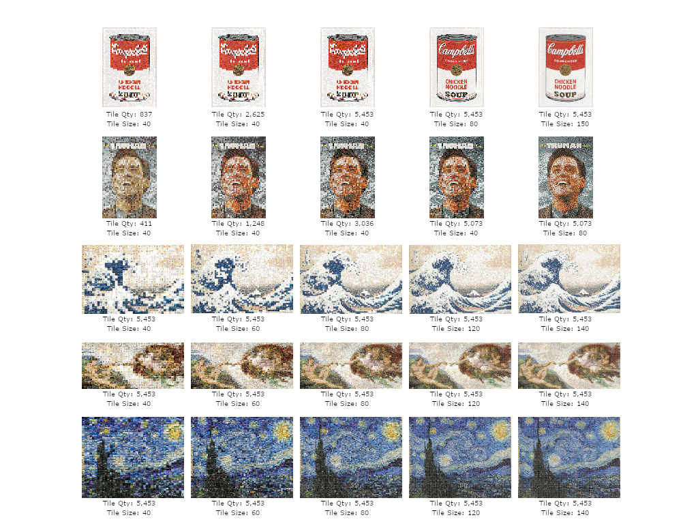

# Lumina Photomosaic Engine

Lumina is a browser-based photomosaic tool. It builds mosaics locally from a target image and a user-supplied photo library, then exports high-resolution PNG masters without uploading source images.

## Current Scope

- Static Vite web app in `index.html`, `style.css`, `app.js`, and `engine.js`.
- Standalone portable build in `Lumina_Portable.html`.
- Local image processing only. Target images and tile libraries remain on the device.
- 4K export for general use and 8K export for capable desktop devices.
- Desktop folder import plus mobile photo import where browser support allows it.

## Project Structure

- `index.html`: Main application shell and controls.
- `style.css`: Shared web-app styling.
- `app.js`: Main browser workflow, import handling, preview rendering, export flow, and UI events.
- `engine.js`: Shared mosaic logic for the modular web app.
- `Lumina_Portable.html`: Self-contained standalone version with inline CSS and JavaScript.
- `vite.config.js`: Vite build configuration using relative asset paths.

## Mosaic Pipeline

1. The user selects a target image.
2. The user imports tile photos from either a photo picker or a folder picker.
3. Each tile is center-cropped to a square 64x64 canvas.
4. A small perceptual hash is used to filter near-duplicate tiles.
5. Average color is converted from RGB into CIELAB for perceptual matching.
6. A KD-tree indexes tile descriptors for fast nearest-candidate lookup.
7. Each mosaic cell samples the target image, finds nearby tile candidates, and re-ranks them with:
   - CIELAB distance
   - highlight and tone penalties
   - adjacency penalties
   - per-tile usage balancing
   - deterministic organic jitter for flatter regions
8. A low-opacity per-cell color glaze nudges each tile toward the target cell color while keeping the source tile visible.
9. The selected tile grid, target colors, and contrast values are cached for export.
10. Exports redraw the selected grid at 4K or 8K and encode as PNG via `toBlob`.

## Import Behavior

The import panel exposes separate controls:

- `Photos`: opens a multi-image file picker. This is the most reliable path for iOS, Android, and desktop browsers.
- `Folder`: opens a directory picker on browsers that support it, then falls back to `webkitdirectory` style folder input when available.

iOS and many mobile browsers do not expose true folder selection to web apps. Native apps can use richer platform photo-library APIs, but browser-based apps are limited to the file picker features the browser exposes.

## Mobile and Memory Notes

Large photo imports can create sustained memory pressure, especially on iOS WebKit. The current import path is tuned to reduce process kills:

- Yields every 8 files during import.
- Uses `toBlob` and object URLs for library previews instead of synchronous `toDataURL`.
- Flushes preview thumbnails in small batches.
- Reuses scratch canvases for intermediate 10x10 and 64x64 draws.
- Closes full-resolution `ImageBitmap` objects as soon as the cropped bitmap is created.

## Preview and Export Notes

- The live preview canvas is 2200px wide and auto-fitted into the preview pane.
- Preview and export use smoothing to reduce visible scan-line or hard pixel artifacts.
- Export uses an offscreen canvas at the requested target width.
- PNG generation uses `canvas.toBlob` so large exports do not block the UI with base64 strings.
- 8K export can still fail on memory-constrained devices.

## Development History

- Started as a compact local photomosaic generator.
- Added mobile-first PWA behavior and high-resolution export.
- Added pinch zoom, preview fitting, export progress feedback, and mobile handling.
- Restored 4K performance by replacing synchronous data URLs with blob-based downloads.
- Added separate folder and photo import flows to cover desktop and mobile browser differences.
- Added iOS-oriented import batching and async thumbnail generation for large libraries.
- Improved tile distribution with candidate re-ranking, repeat suppression, adjacency penalties, and deterministic jitter.
- Added tone protection for bright skin highlights and a conservative per-cell color glaze.
- Refactored modular mosaic scoring into `engine.js`.
- Removed inactive drag/drop UI and its unused thumbnail wiring.

## Standalone Portable File

`Lumina_Portable.html` is intentionally self-contained. That makes it useful where a single file is easier to move or host, but it means some logic is duplicated inline. For long-term maintenance, the portable file should eventually be generated from the modular source to avoid drift.

## Development

Install dependencies:

```bash
npm install
```

Run the local development server:

```bash
npm run dev
```

Build production assets:

```bash
npm run build
```

Preview the production build:

```bash
npm run preview
```
## Future Directions
Each mosaic is a fingerprint waiting to become a key.

Local-only pipeline can be extended into a sovereign provenance system without changing the mosaic hot path. At import, each tile's raw file bytes could be hashed with SHA-256 (via WebCrypto, requires HTTPS or localhost) and combined into a Merkle root portable library fingerprint identifying a photo collection without revealing it. 

At generation, root should be concatenated with the target image's file hash and the canonical-rendered mosaic hash, then signed with an author keypair stored locally. A third-party with the signature and public key can verify authorship; a third party with additional access to the library and target can verify honest construction. 

The cost lives at the boundaries (one hash per file at import, one signature at export), scaling with library size on disk I/O, not with mosaic resolution. Thought: key persistence and backup UX (IndexedDB + export flow), whether to anchor signatures to an external timestamp authority for non-repudiation, and tolerance for re-encoded source files breaking byte-exact library fingerprints.

The image can be copied. The making of it cannot.
